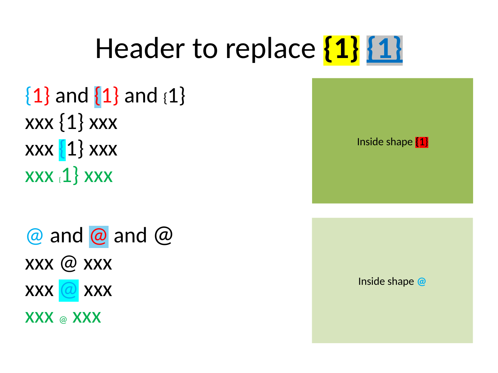
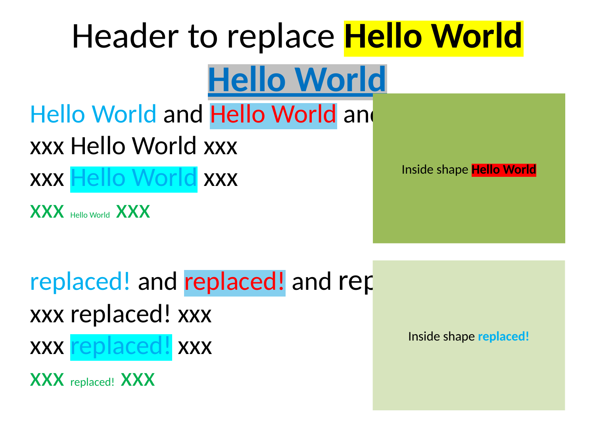

```{r}
#| echo: false
#| message: false
#| warning: false

library(officer.pptx)
knitr::opts_chunk$set(
  collapse = TRUE,
  comment = "#>"
)
```

## Introduction

`text_replace()` finds and replaces text patterns in PowerPoint slides while preserving character formatting. It is designed for template workflows where placeholders like `@name` or `{date}` are filled in programmatically.

Key features:

- **Format preservation**: The replacement inherits the formatting of the first matched character.
- **Replacement log**: Every call records what was replaced, where, and how often.
- **Dry-run mode**: Preview replacements without modifying the file.
- **Expectations**: Assert that patterns were replaced the expected number of times.

## Before and After

Here is what `text_replace()` does. The template slide (slide 1) contains placeholders `{1}` and `@`
with different formatting (bold, italic, colored):

{width=100%}

After replacement with the following code, each placeholder is filled with the new text while
preserving the formatting of the first character of the matched pattern:

```{r}
#| eval: false
x <- read_pptx(example_pptx("text_replace"))
x <- text_replace(x, "{1}" = "Hello World", "@" = "replaced!", slide_idx = 1)
```

{width=100%}

## Basic Usage

Pass pattern/replacement pairs as named arguments:

```{r}
file_in <- example_pptx("text_replace")
x <- read_pptx(file_in)
x <- text_replace(x, "{1}" = ">>>", "@" = ":)")
```

Alternatively, use the `pattern` and `replacement` vectors:
 
```{r}
x <- read_pptx(file_in)
x <- text_replace(x, pattern = c("{1}", "@"), replacement = c(">>>", ":)"))
```

Both styles can be combined.

## Limiting to Specific Slides

Use `slide_idx` to restrict replacements to selected slides:

```{r}
x <- read_pptx(file_in)
x <- text_replace(x, "{1}" = ">>>", slide_idx = 1)
```

## The Replacement Log

After calling `text_replace()`, a log is attached to the object. Retrieve it with `text_replace_log()`:

```{r}
x <- read_pptx(file_in)
x <- text_replace(x, "{1}" = ">>>", "@" = ":)", verbose = 0)
text_replace_log(x)
```

The log is a tibble with columns:

| Column | Description |
|--------|-------------|
| `slide_idx` | Slide number |
| `shape_name` | Name of the shape in PowerPoint |
| `pattern` | The pattern that was matched |
| `replacement` | The replacement string |
| `count` | Number of replacements in that shape |

## Dry-Run Mode

Set `dry_run = TRUE` to see what *would* be replaced without modifying the presentation:

```{r}
x <- read_pptx(file_in)
x <- text_replace(x, "{1}" = ">>>", dry_run = TRUE)
text_replace_log(x)
```

The log is populated as usual but the XML remains unchanged. This is useful for validating templates before committing changes.

## Silencing Console Output

By default, `text_replace()` prints a one-line summary (`verbose = 1`). Set `verbose = 0` for silence, or `verbose = 2` for a detailed per-shape breakdown:

```{r}
x <- read_pptx(file_in)

# silent
x <- text_replace(x, "{1}" = ">>>", verbose = 0)

# detailed per-shape output
x <- read_pptx(file_in)
x <- text_replace(x, "{1}" = ">>>", verbose = 2)
```

## Asserting Expectations

In production pipelines you often want to verify that all placeholders were actually found and replaced. `text_replace_expect()` checks the log and aborts if expectations are not met:

```{r}
#| error: true
x <- read_pptx(file_in)
x <- text_replace(x, "{1}" = ">>>", "@" = ":)", verbose = 0)

# passes silently
x |> text_replace_expect("{1}", min = 1)

# fails because the pattern was replaced more than 0 times
x |> text_replace_expect("{1}", n = 0)
```

### Available Checks

| Argument | Meaning |
|----------|---------|
| `n` | Exactly this many replacements expected |
| `min` | At least this many |
| `max` | At most this many |

`n` is mutually exclusive with `min`/`max`.

### Per-Slide Expectations

Restrict the check to specific slides with `slide_idx`:

```{r}
x <- read_pptx(file_in)
x <- text_replace(x, "{1}" = ">>>", verbose = 0)

# only check slide 1
x |> text_replace_expect("{1}", min = 1, slide_idx = 1)
```

## Pipeline Example

A typical template-filling workflow:

```{r}
#| eval: false
read_pptx("template.pptx") |>
  text_replace(
    "@title" = "Monthly Report",
    "@date"  = format(Sys.Date(), "%d.%m.%Y"),
    "@author" = "Analytics Team"
  ) |>
  text_replace_expect("@title", n = 1) |>
  text_replace_expect("@date", min = 1) |>
  text_replace_expect("@author", n = 1) |>
  print(target = "report.pptx")
```

This ensures the pipeline fails early if a placeholder is missing or duplicated unexpectedly.

## Pattern Matching Details

Patterns are matched as fixed strings (no regex). Since matching is substring-based,
shorter patterns can match inside longer ones. For example, `"[2]"` also matches
inside `"[[2]]"` since it is a substring.

To avoid such collisions, `text_replace()` automatically sorts patterns longest-first
within each call. So this works correctly without manual ordering:

```{r}
#| eval: false
x |>
  text_replace("[[name]]" = "Mark", "[name]" = "Mark")
```

If you use separate calls, longer patterns should still come first:

```{r}
#| eval: false
x |>
  text_replace("[[name]]" = "Mark") |>
  text_replace("[name]" = "Mark")
```
